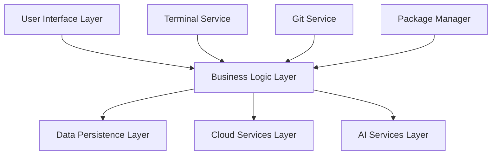

# Python IDE for Android - Enhanced Edition

[](https://github.com/pythonide/android/releases)
[](LICENSE)
[](https://developer.android.com/)
[](#)

<div align="center">


**The Most Advanced Python IDE for Android Devices**

[Features](#features) • [Screenshots](#screenshots) • [Download](#download) • [Documentation](#documentation) • [Contributing](#contributing)

</div>

## 🎯 Overview

Python IDE for Android is a revolutionary, AI-powered integrated development environment that brings the full power of Python development to your Android device. Built with modern mobile UX principles and enterprise-grade features, it enables developers to create, debug, and deploy Python applications anywhere, anytime.

### ✨ What Makes It Special

- **🤖 AI-Powered Development**: Smart code completion, error detection, and intelligent formatting
- **☁️ Cloud Integration**: Seamless project synchronization across all your devices
- **👥 Real-time Collaboration**: Work together on projects with live code sharing
- **🚀 One-Click Deployment**: Deploy to major cloud platforms directly from your phone
- **📊 Advanced Analytics**: Performance profiling and debugging tools
- **🔒 Enterprise Security**: Built-in security scanning and vulnerability detection

## 🚀 Features

### Core Development Features

- **🐍 Full Python Support**: All Python 3.x versions with instant execution
- **📦 Package Management**: Integrated pip with virtual environment support
- **🎨 Advanced Editor**: Syntax highlighting, auto-completion, code folding
- **🔍 Smart Search**: Regex-powered search with advanced replace functionality
- **📱 Mobile-Optimized UI**: Touch-friendly interface with gesture support

### AI & Intelligence

- **🧠 AI Code Assistant**: Intelligent code suggestions and optimization
- **⚡ Smart Completion**: Context-aware auto-completion
- **🐛 Error Detection**: Real-time syntax and logic error detection
- **📝 Code Formatting**: Automatic code styling and formatting

### Collaboration & Cloud

- **☁️ Cloud Sync**: Real-time project synchronization
- **👥 Team Collaboration**: Multi-user editing with conflict resolution
- **📤 Easy Export**: Git integration with GitHub/GitLab support
- **💾 Auto Backup**: Automatic project backups to cloud storage

### Advanced Tools

- **🧪 Built-in Testing**: Unit test runner and test case management
- **📊 Performance Profiler**: Memory and CPU usage analysis
- **🔧 Terminal Integration**: Full-featured terminal emulator
- **📋 Code Snippets**: Reusable code template management
- **🎯 Macro Recording**: Automate repetitive coding tasks

## 📸 Screenshots

<div align="center">


*Main interface with project navigation*


*Advanced code editor with AI assistance*


*AI-powered code suggestions*


*Integrated terminal with Python support*


*Real-time collaboration interface*

</div>

## 📦 Download

### Stable Release (Recommended)
- **[Download APK v2.0.0](https://github.com/pythonide/android/releases/latest)** - Latest stable release
- **[Google Play Store](https://play.google.com/store/apps/details?id=com.pythonide)** - Official store version

### Beta/Pre-release
- **[Beta APK v2.1.0-beta](https://github.com/pythonide/android/releases/tag/v2.1.0-beta)** - Latest beta features
- **[Debug APK](https://ci.pythonide.com/artifacts/latest-debug.apk)** - Latest development build

### System Requirements

- **Android Version**: 7.0 (API level 24) or higher
- **RAM**: 4GB minimum, 6GB recommended
- **Storage**: 1GB free space
- **Processor**: ARM64 or ARMv7 with hardware virtualization support

## 🛠️ Quick Start

### 1. Installation

```bash
# Download and install the APK
adb install pythonide.apk

# Or install via Google Play Store
# Search for "Python IDE Android"
```

### 2. First Project

1. **Launch the app** and create your first project
2. **Choose a template** (Flask, Django, Data Science, etc.)
3. **Start coding** with AI assistance enabled
4. **Run your code** using the integrated terminal
5. **Deploy** to cloud platforms with one click

### 3. Essential Commands

```python
# Access built-in packages
import sys
print(sys.version)

# Install packages
!pip install requests numpy pandas

# Use AI assistance
# Type "def " and wait for AI suggestions
# Use Ctrl+Space for manual completion
```

## 📚 Documentation

- **[📖 User Guide](docs/USER_GUIDE.md)** - Complete user documentation
- **[🛠️ Development Guide](DEVELOPMENT.md)** - Setup for contributors
- **[🚀 Deployment Guide](DEPLOYMENT.md)** - Build and deploy instructions
- **[📋 Feature List](FEATURES.md)** - Detailed feature documentation
- **[📝 Changelog](CHANGELOG.md)** - Version history and updates
- **[🔧 API Documentation](docs/api/)** - Developer API reference

## 🏗️ Architecture



## 🤝 Contributing

We welcome contributions from the community! Here's how to get started:

1. **Fork the repository**
2. **Create a feature branch** (`git checkout -b feature/amazing-feature`)
3. **Make your changes** and add tests
4. **Commit your changes** (`git commit -m 'Add amazing feature'`)
5. **Push to the branch** (`git push origin feature/amazing-feature`)
6. **Open a Pull Request**

### Development Setup

```bash
# Clone the repository
git clone https://github.com/pythonide/android.git
cd android

# Open in Android Studio
# Follow DEVELOPMENT.md for complete setup
```

## 🐛 Bug Reports

Found a bug? Please report it:

1. **Check existing issues** - Avoid duplicates
2. **Create a detailed report** with steps to reproduce
3. **Include system information** and error logs
4. **Attach screenshots** if relevant

[🐛 Report Bug](https://github.com/pythonide/android/issues/new?template=bug_report.md)

## 💡 Feature Requests

Have an idea for a new feature? We'd love to hear it!

[💡 Request Feature](https://github.com/pythonide/android/issues/new?template=feature_request.md)

## 📄 License

This project is licensed under the MIT License - see the [LICENSE](LICENSE) file for details.

```
MIT License

Copyright (c) 2025 Python IDE Android Contributors

Permission is hereby granted, free of charge, to any person obtaining a copy
of this software and associated documentation files (the "Software"), to deal
in the Software without restriction, including without limitation the rights
to use, copy, modify, merge, publish, distribute, sublicense, and/or sell
copies of the Software, and to permit persons to whom the Software is
furnished to do so, subject to the following conditions:

The above copyright notice and this permission notice shall be included in all
copies or substantial portions of the Software.
```

## 🙏 Acknowledgments

- **Android Development Team** - For the robust Android platform
- **Python Community** - For the amazing Python ecosystem
- **JetBrains** - For Kotlin language and development tools
- **Our Contributors** - For making this project possible

## 📊 Project Stats


---

<div align="center">

**Made with ❤️ for the Python community**

[Website](https://pythonide.com) • [Twitter](https://twitter.com/pythonide) • [Discord](https://discord.gg/pythonide) • [Reddit](https://reddit.com/r/pythonide)

</div>